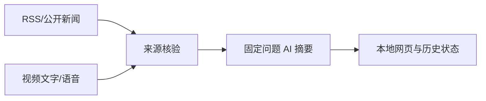

# 024 市场情报终端 | Market Intelligence

> 把公开新闻、视频文字、来源核验和 AI 摘要组织成可追溯的信息工作流。
>
> **English:** A practical, runnable project with a documented workflow for the problem described above.

## 项目展示 / Demo

## 解决什么问题 / Problem

解决公开信息分散、来源难核验、视频内容难整理以及固定问题无法持续追踪的问题。

**English:** This project addresses the problem above with a reproducible local workflow.

## 有什么用 / Use

定时采集公开来源，整理视频文字和语音，按固定问题生成带来源链接的市场研判页面。

**English:** Run the workflow locally, inspect the output, and extend the project from the provided source.

## 高光亮点 / Highlights

- 公开新闻/RSS 多源采集
- 视频文字整理与本地 Vosk 转写
- 24 小时证据窗口和来源链接
- DeepSeek 定时摘要与行情快照

## 技术名词 / Tech

`Python · HTML/CSS/JavaScript · RSS · Vosk · DeepSeek API`

## 从 ZIP 开始复现 / Reproduce from ZIP

1. 下载 ZIP 并解压。
2. 复制 ...env.example 为 ...env，填写 DEEPSEEK_API_KEY 等配置。
3. 执行 python app.py，默认监听 http://127.0.0.1:19083。
4. 打开首页查看最新摘要，健康检查为 http://127.0.0.1:19083/health。
5. 需要核验来源时执行 python verify_sources.py --data-dir .\data。

**Expected result:** 页面展示最新栏目、证据状态、来源链接和 AI 研判；没有可靠证据时保留待确认状态。

## 目录提示 / Notes

- 先阅读本 README，再按项目内更详细的中文/英文文档补充配置。
- 不要把真实密码、Token、数据库业务数据和本机运行结果提交回仓库。
- 下载 ZIP 后的第一次运行应使用测试数据或示例图片，确认链路正常后再接入自己的环境。

[English documentation](README.en.md)
